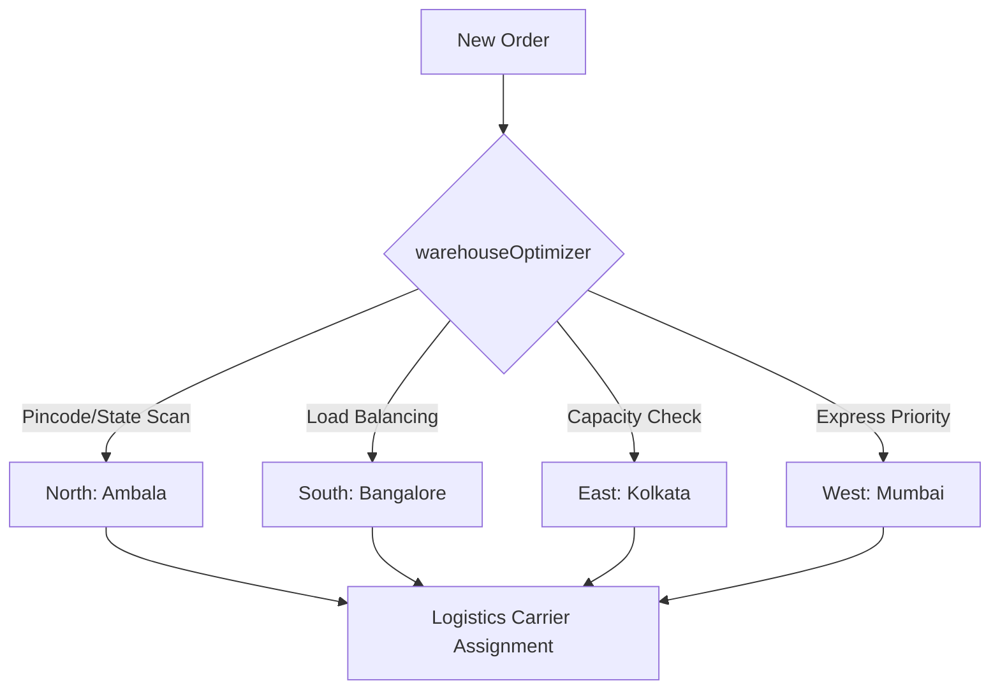
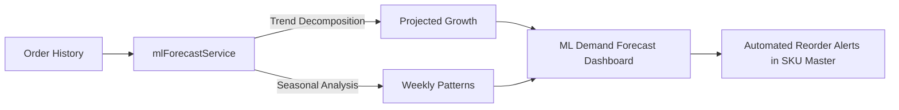

# 🧠 BLUEWUD OTS: MASTER AI OPERATIONAL MANUAL

This is the **Single Source of Truth** for all AI agents working on the Bluewud OTS. This document combines operational principles, coordination protocols, and the technical roadmap.

---

## 🤖 1. Core Operational Principles
1. **SSOT (Single Source of Truth)**: Use `DataContext.jsx` for all global state (Orders, Inventory, Customers).
2. **State Machine Enforcement**: All status changes **MUST** pass through `orderStateMachine.js` via `updateOrderStatus` in `DataContext`.
3. **Glassmorphism Theme**: UI components must use `glass` and `glass-hover` classes from `App.css`.
4. **Clean Code**: No duplicate imports. Modularize services in `src/services/` and utilities in `src/utils/`.

---

## 🤝 2. Multi-Agent Coordination Protocol
To prevent "Ghost Work" (work repetition) or state conflicts:

### 2.1 Task Tracking
- **Available**: `[ ]`
- **Claimed**: `[/] CLAIMED BY [AGENT_ID] @ [ISO_TIME]`
- **Active**: Frequently update sub-tasks and `walkthrough.md`.
- **Completed**: `[x]`

### 2.2 File Locking
Before major edits to core files (e.g., `DataContext.jsx`, `App.jsx`), check `LOCKS.md`.
- **Lock Format**: `LOCK [FILE_PATH] [AGENT_ID] [ISO_TIME]`
- **Unlocking**: Remove your entry immediately after `notify_user` or finishing your session.

### 2.3 Handoff Rule
Before closing your session:
1. Update `task.md` with the **VERY NEXT** step.
2. Ensure `walkthrough.md` has verification logs.
3. Clear your locks in `LOCKS.md`.

---

## 🗺️ 3. Master Product Roadmap

### Completed Phases (v1.0 Production Hub)
- [x] **Phase 18: Advanced Fulfillment**: Thermal ZPL, AI Carrier Optimization, WhatsApp Lifecycle.
- [x] **Phase 19: Financial Audit & Sync**: Zoho Dynamic Sync, Logistics Cost Auditing, Hub Transfers.
- [x] **Phase 20: Resilience & PWA**: Offline Persistence (IndexedDB), Service Worker, Push Alerts.

---

## 🗺️ 4. Strategic Roadmap (COMPLETED ✅)

### Phase 21: Advanced AI Agent Orchestration ✅
- [x] **Multi-Agent Handoff**: `handoffService.js` and `handoff.js` CLI for session summaries.
- [x] **Context Injection Engine**: `contextInjection.js` for codebase indexing.

### Phase 22: Predictive Supply Chain & Vendor Hub ✅
- [x] **Lead-Time Analysis**: `vendorService.js` and `predictVendorArrival` in `forecastService.js`.
- [x] **Quality Control AI (GRN QC)**: `qcService.js` with AI scan simulation.

### Phase 23: Global Logistics & Tax Bridge ✅
- [x] **Multi-Currency Pricing Engine**: `currencyService.js` with INR/USD/AED/EUR support.
- [x] **Compliance Hub**: `complianceService.js` for HSN codes and E-way bills.

### Phase 24: Intelligent CRM & Churn Defense ✅
- [x] **Retention AI (Churn Prediction)**: `churnService.js` with risk scoring.
- [x] **Automated Outreach**: WhatsApp reactivation in `CustomerLookup.jsx`.

---

## 🚀 5. Post-v2.0 Expansion Ideas (Future Consideration)
### Phase 25: Multi-Warehouse Fulfillment ✅
- [x] **Intelligent Routing**: `warehouseOptimizer.js` for regional hub selection.
- [x] **Load Balancing**: Capacity-aware assignment logic.
- [x] **UI Control**: `WarehouseSelector.jsx` for hub monitoring.

### Phase 26: Real-time ML Demand Forecasting ✅
- [x] **Prophet-like Forecasting**: Enhanced ML logic for demand prediction in `mlForecastService.js`.
- [x] **Trend Decomposition**: Visualizing seasonal and growth components in `MLAnalyticsDashboard.jsx`.
- [x] **Operational Integration**: RRQ insights and stock-out risks integrated in `SKUMaster.jsx`.

### Phase 27: B2B Dealer Portal & RBAC ✅
- [x] **Role-Based Access**: Specialized `Guard` component and permission boundaries in `rbacMiddleware.js`.
- [x] **Wholesale Logic**: Tiered pricing (Gold/Platinum) and credit management in `dealerService.js`.
- [x] **Partner Portal**: Dedicated `DealerPortal.jsx` for seamless wholesale ordering.

### Phase 28: RTO Prediction & Reverse Logistics ✅
- [x] **Risk Scoring**: `rtoService.js` for predictive COD return analysis.
- [x] **Reverse Logistics**: `reverseLogisticsService.js` for automated RMA and return windows.
- [x] **UI Integration**: Risk badges in `OrderList.jsx` and RTO KPIs in `PerformanceMetrics.jsx`.

### Phase 29: AI-Powered Inventory Intelligence ✅
- [x] **Predictive Restocking**: Reorder Point (ROP) logic based on ML demand in `mlForecastService.js`.
- [x] **Warehouse Rebalancing**: `InventoryOptimizer.js` suggesting transfers between hubs.
- [x] **StockOptix UI**: Inventory heatmaps and aging analysis in `StockOptix.jsx`.

### Phase 30: Marketplace Automation & Ecosystem Integration ✅
- [x] **Amazon Bridge**: Bi-directional inventory sync via `AmazonMapper.jsx` and `MarketplaceSyncService.js`.
- [x] **Marketplace Reconciliation**: Automated fee analysis and net margin calculation in `MarketplaceReconciliation.jsx`.
- [x] **Universal Import**: Smart Auto-Map for unknown CSV/Excel formats in `UniversalImporter.jsx`.

---

## 🏗️ 5. Global System Architecture

### 5.1 Fulfillment & Logistics (Phase 25)
Intelligent routing engine for multi-region hubs.



### 5.2 Real-time ML Forecasting (Phase 26)
Predictive demand modeling using historical sales data.



### 5.3 RBAC Permission Matrix (Phase 27)
Security boundaries for multi-stakeholder management.

| Feature / Node | Admin | Manager | Dealer | Viewer |
| :--- | :---: | :---: | :---: | :---: |
| **Analytics Dashboard** | ✅ | ✅ | ❌ | ✅ |
| **Orders (Global View)** | ✅ | ✅ | ❌ | ✅ |
| **Partner Portal (Wholesale)** | ✅ | ✅ | ✅ | ❌ |
| **BOM / Finance Auditor** | ✅ | ✅ | ❌ | ❌ |
| **Activity Logs (Audit)** | ✅ | ❌ | ❌ | ❌ |
| **System Settings** | ✅ | ❌ | ❌ | ❌ |

---

## 📋 5. Maintenance & Production Health Checks
1. **Zoho Bridge Health**: Monitor `syncDeltaOrders` logs for 401/403 errors (Token expiry).
2. **IndexedDB Maintenance**: Periodically call `cache.clearExpiredData()` in `DataContext`.
3. **PWA Updates**: Bump `CACHE_VERSION` in `sw.js` when deploying critical CSS/JS changes.
4. **Environment Integrity**: Ensure `VITE_` variables are always synchronized across CI/CD nodes.

---

## 📋 4. Integration Checklist (Snippet-to-Production)
1. **Service**: Copy snippet to `src/services/`, register in `index.js`.
2. **Context**: Wire service logic into `DataContext.jsx` if it affects global state.
3. **UI**: Add component to `App.jsx`, registers sidebar link.
4. **Env**: Ensure all `VITE_` variables in `.env` match the latest `AI_INTEGRATION_PACKAGE` requirements.

---

## 🔗 5. Critical Environment Variables
```env
VITE_CATALYST_PROJECT_ID=...
VITE_WHATSAPP_API_TOKEN=...
VITE_DELHIVERY_API_TOKEN=...
VITE_IP_WHITELIST_ENABLED=true
```

---
*Maintained by Antigravity AI - Final Assembly Mode*
